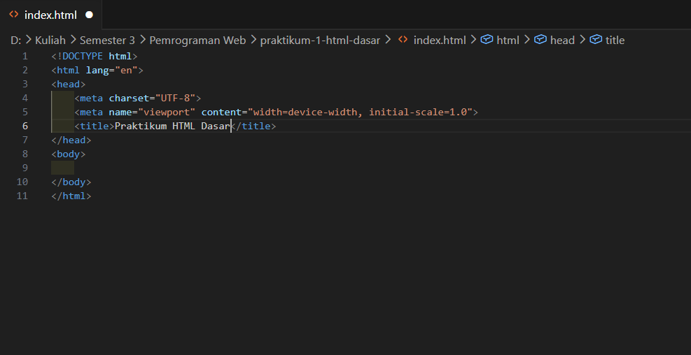
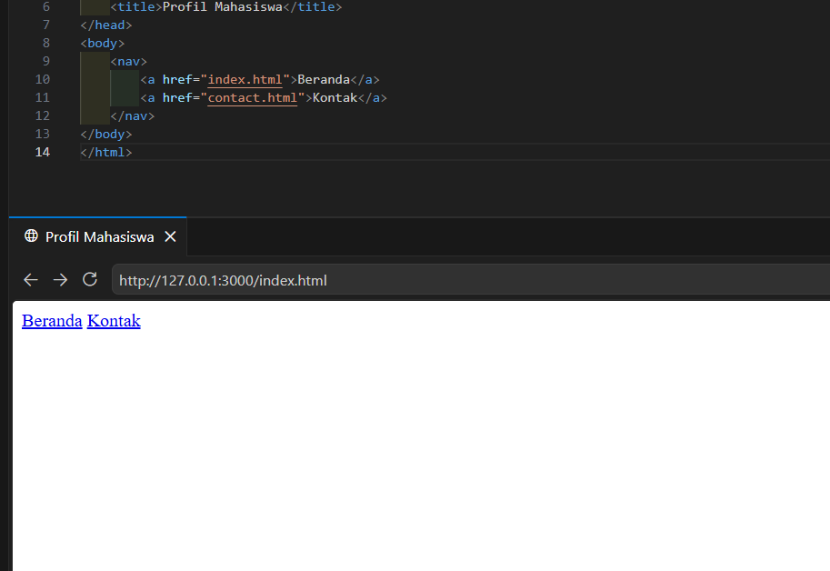
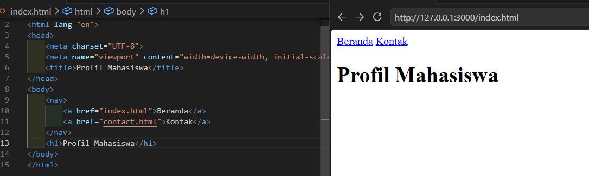
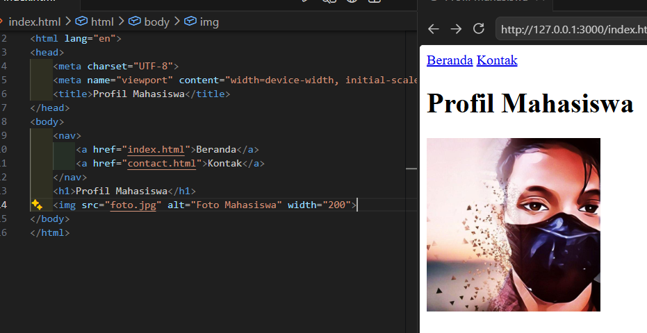
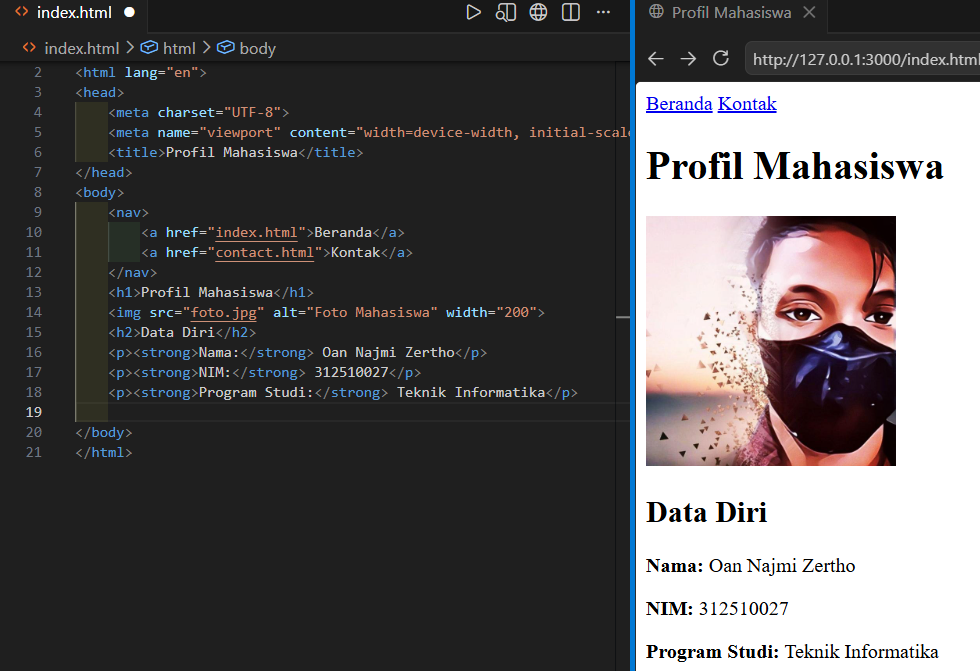
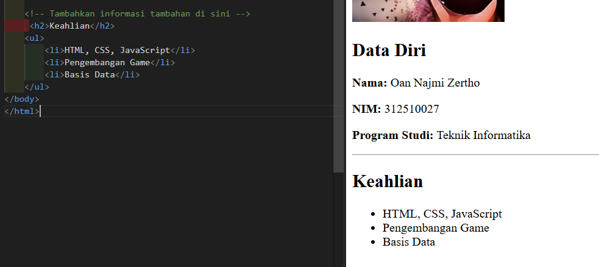
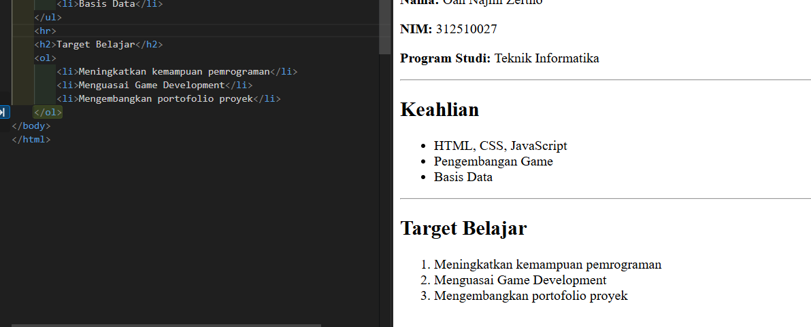

# Laporan Praktikum 1 - Pemrograman Web

**Nama:** Oan Najmi Zertho  
**NIM/Kelas:** 321510027 / I.25.3A  
**Prodi:** Teknik Informatika  
**Mata Kuliah:** Pemrograman Web  
**Dosen:** Agung Nugroho S.Kom, M.Kom

## Langkah Praktikum

### Persiapan deklarasi dokumen HTML

Persiapan dokumen menggunakan deklarasi:
Pada bagian `<head>` berisi `metadata` seperti penggunaan `charset`, `viewport`, dan lainnya.
Judul halaman web juga diisi di bagian ini dengan tag `<title>`.

```html
<!DOCTYPE html>
<html lang="en">
  <head>
    <meta charset="UTF-8" />
    <meta name="viewport" content="width=device-width, initial-scale=1.0" />
    <title>Profil Mahasiswa</title>
  </head>
  <body></body>
</html>
```



### 1. Membuat navigasi

Buat navigasi untuk berpindah antar halaman dengan tag `<nav>` dan tag `<a>` sebagai hyperlink.

```html
<nav>
  <a href="index.html">Beranda</a>
  <a href="contact.html">Kontak</a>
</nav>
```



### 2. Memberikan judul utama

Berikan judul utama dengan tag `<h1>`.

```html
<h1>Profil Mahasiswa</h1>
```



### 3. Menambahkan gambar profil

Berikan gambar profil dengan memasukkan tag `` dan rujukan file `.jpg` dengan atribut `src`.

```html

```

Atribut `alt` berfungsi sebagai nama atau caption dari foto tersebut, namanya akan muncul jika user klik/membuka foto.



### 4. Menambahkan subjudul dan data diri

Berikan subjudul dengan tag `<h2>`, lalu di bawahnya tambahkan data diri berupa nama dan program studi dengan tag `<p>`. Gunakan tag `<strong>` agar tulisan judul menjadi **bold**.
Gunakan pemformatan teks dengan elemen `<strong>` agar judul atau suatu karakter menjadi lebih tebal atau **bold**. Ada juga format teks lain seperti `<italic>` yang bisa membuat karakter menjadi huruf miring.

```html
<h2>Data Diri</h2>
<p><strong>Nama:</strong> Oan Najmi Zertho</p>
<p><strong>NIM:</strong> 312510027</p>
<p><strong>Program Studi:</strong> Teknik Informatika</p>
<hr />
```

Elemen `<hr>` berfungsi untuk membuat garis horizontal sebagai pembatas antar konten.



### 5. Membuat daftar keahlian

Berikan subjudul keahlian dengan tag `<h2>` dan buat list bullet menggunakan tag `<ul>` dan `<li>`.
Unordered List atau `<ul>` merupakan tipe list tanpa urutan seperti titik atau **bullet** dan tag `<li>` untuk menampilkan konten list.

```html
<!-- Tambahkan informasi tambahan di sini -->
<h2>Keahlian</h2>
<ul>
  <li>HTML, CSS, JavaScript</li>
  <li>Pengembangan Game</li>
  <li>Basis Data</li>
</ul>
<hr />
```

Tag komentar yaitu `<!-- isi komentar -->` bisa dipakai untuk petunjuk pengembangan atau batas konten yang akan dibuat.



### 6. Membuat target belajar

Buat list target belajar secara berurutan menggunakan tag `<ol>` dan `<li>`.
Ordered List atau `<ol>` merupakan tipe list yang berurutan seperti angka `1, 2, 3, dst` dan tag `<li>` untuk menampilkan konten list.

```html
<ol>
  <li>Meningkatkan kemampuan pemrograman</li>
  <li>Menguasai Game Development</li>
  <li>Meng</li>
</ol>
```


